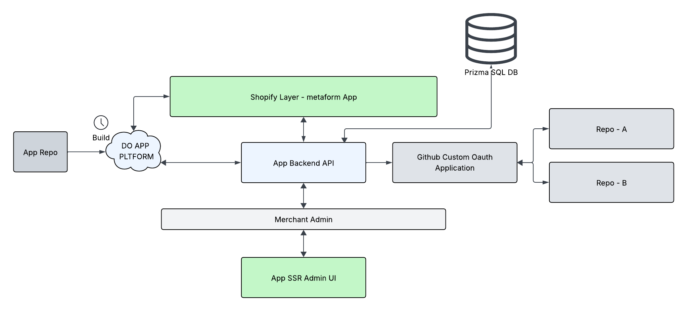

# MetaForm

**Config-as-code for Shopify metafields and metaobjects.**

Sync definitions across environments with GitHub. Push from your store, promote via Pull Requests, pull into any store — with a full diff before you apply.

MetaForm is built for teams running **dev → UAT → production** who need metafield and metaobject definitions to stay in sync without manual copy-paste or drift.

---

## Architecture

MetaForm runs as a Shopify app with a backend API, GitHub OAuth, and optional deployment on DigitalOcean App Platform. Definitions live in your repo; the app pushes and pulls them from the store.



---

## Screenshots

| | |
|---|---|
| **Settings** — GitHub OAuth credentials, repository, branch, file path, and optional sync source. | **Definitions** — Browse all metafield and metaobject definitions on the store. |
|  |  |
| **Sync Data** — Review changes from source (added, modified, removed) and create a branch + PR to promote. | **Sync Data (changes)** — Detailed view of added metafields and metaobjects before applying. |
|  |  |

---

## Table of Contents

- [Architecture](#architecture)
- [Screenshots](#screenshots)
- [Quick Start](#quick-start)
- [What MetaForm Does](#what-metaform-does)
- [How It Works](#how-it-works)
- [GitHub OAuth App Setup](#github-oauth-app-setup)
- [App Configuration](#app-configuration)
- [Pages and Features](#pages-and-features)
- [Project Structure](#project-structure)
- [Deployment](#deployment)
- [Tech Stack](#tech-stack)
- [Troubleshooting](#troubleshooting)

---

## Quick Start

### Prerequisites

- [Node.js](https://nodejs.org/) 20.10 or higher
- [Shopify CLI](https://shopify.dev/docs/apps/tools/cli) installed globally
- A [Shopify Partner account](https://www.shopify.com/partners) with a development store
- A [GitHub account](https://github.com)

### 1. Clone and install

```shell
git clone https://github.com/your-org/shopify-metaform.git
cd shopify-metaform
npm install
```

### 2. Connect to your Shopify Partner app

```shell
shopify app config link
```

This connects the project to your Shopify Partner app. If you don't have one yet, the CLI will walk you through creating one.

### 3. Run the database migration

```shell
npx prisma migrate deploy
```

### 4. Start the dev server

```shell
shopify app dev
```

Press `p` to open the app in your browser. Install it on your development store when prompted.

### 5. Configure GitHub (inside the app)

1. [Create a GitHub OAuth App](#github-oauth-app-setup) -- set the callback URL shown on the Settings page
2. Open MetaForm **Settings** in the Shopify admin
3. Enter your GitHub OAuth App **Client ID** and **Client Secret**, click **Save credentials**
4. Click **Connect to GitHub** -- a popup opens for authorization
5. After authorizing, select your **repository** and **branch**
6. Click **Save settings**

You're ready to push and pull definitions.

---

## What MetaForm Does

MetaForm manages **metafield definitions** and **metaobject definitions** -- the schemas that define custom data structures on your Shopify store. It does **not** manage the values or entries stored in those fields (that's a future feature).

### The problem

When you have multiple Shopify stores (dev, staging, production), there's no built-in way to keep metafield and metaobject definitions in sync. Developers end up manually recreating definitions in each environment, leading to:

- Definition drift between environments
- Broken deployments when a field is missing in production
- No audit trail of what changed and when
- No review process for schema changes

### The solution

MetaForm treats definitions as config-as-code:

- **Push** your store's definitions to a GitHub branch as a JSON file
- **Sync** definitions from a source environment into your store
- **Promote** definitions between environments using GitHub Pull Requests
- **Diff** before applying -- see exactly what will be created, updated, or removed

---

## How It Works

Each Shopify store maps to a branch in a GitHub repository:

```
Dev Store    -->  dev branch
UAT Store    -->  uat branch
Prod Store   -->  main branch
```

### Typical workflow

1. A developer creates or modifies metafield definitions on the **dev store**
2. They open MetaForm and click **Push** -- the definitions are committed to the `dev` branch
3. They go to **Settings** and click **Open PR on GitHub** targeting the `uat` branch
4. The team reviews the PR on GitHub (GitHub shows the JSON diff natively)
5. The PR is merged into `uat`
6. On the **UAT store**, the developer opens MetaForm and clicks **Pull** -- a diff preview shows what will change
7. They click **Apply** to sync the definitions
8. Repeat the PR workflow from `uat` to `main` for production

### Data flow: Push

```
Store Definitions --> MetaForm captures snapshot --> Diffs against branch file --> Commits to GitHub
```

1. MetaForm queries all metafield definitions (across all owner types) and metaobject definitions via the Shopify Admin GraphQL API
2. It serializes them into a canonical JSON format (`definitions.json`)
3. It reads the current file from the GitHub branch and computes a diff
4. If there are changes, it commits the new file with a descriptive commit message

### Data flow: Pull

```
GitHub branch file --> MetaForm reads + parses --> Diffs against store --> User confirms --> Mutations applied
```

1. MetaForm reads `definitions.json` from the connected branch
2. It queries the current store's definitions
3. It computes a diff: what needs to be created, updated, or deleted
4. The user reviews the diff and confirms
5. MetaForm executes the GraphQL mutations (`metafieldDefinitionCreate`, `metaobjectDefinitionCreate`, etc.)

---

## GitHub OAuth App Setup

MetaForm connects to GitHub using an OAuth App that you create on your own GitHub account.

### 1. Create a GitHub OAuth App

1. Go to [GitHub Developer Settings > OAuth Apps](https://github.com/settings/developers)
2. Click **New OAuth App**
3. Fill in:
   - **Application name**: `MetaForm` (or whatever you like)
   - **Homepage URL**: Your app's URL
   - **Authorization callback URL**: Copy this from the MetaForm Settings page (it's shown at the top of the credentials section). The format is `https://<your-app-url>/auth/github/callback`
4. Click **Register application**
5. Copy the **Client ID**
6. Click **Generate a new client secret** and copy the **Client Secret**

> **During development**: The callback URL changes when `shopify app dev` restarts the tunnel. Update the callback URL in your GitHub OAuth App settings after each restart. The current URL is always displayed on the MetaForm Settings page.

### 2. Enter credentials in MetaForm

1. Open MetaForm in your Shopify admin
2. Go to **Settings**
3. Note the **Authorization callback URL** shown at the top -- make sure it matches your GitHub OAuth App
4. Enter your **Client ID** and **Client Secret**
5. Click **Save credentials**

### 3. Connect to GitHub

1. Click **Connect to GitHub** (appears after saving credentials)
2. A popup window opens with GitHub's authorization page
3. Click **Authorize** on GitHub
4. The popup shows "Connected!" and closes automatically
5. The Settings page refreshes to show your GitHub username and repository options

The credentials and access tokens are stored securely in the app's database with AES-256-GCM encryption. Nothing is stored in environment variables.

---

## App Configuration

All configuration is stored in the app's SQLite database. There are no environment variables to set beyond the standard ones provided by the Shopify CLI.

| Setting | Where it's stored | How it's set |
|---|---|---|
| GitHub Client ID | `AppConfig` table | Settings page |
| GitHub Client Secret | `AppConfig` table (encrypted) | Settings page |
| Encryption key | `AppConfig` table | Auto-generated on first use |
| GitHub access token | `GitHubConnection` table (encrypted) | OAuth flow |
| Repository / branch | `GitHubConnection` table | Settings page |

---

## Pages and Features

### Dashboard (`/app`)

Overview page showing:
- Count of metafield definitions and metaobject definitions on the store
- GitHub connection status and sync state
- Quick action buttons (Push, Pull, View Definitions)
- Recent sync activity log

### Definitions (`/app/definitions`)

Read-only browser of all definitions currently on the store:
- **Metafields tab**: All metafield definitions, filterable by owner type (Product, Customer, Order, Collection, etc.)
- **Metaobjects tab**: All metaobject definitions with field counts and capabilities

### Push (`/app/push`)

Push your store's current definitions to GitHub:
1. Captures a snapshot of all definitions
2. Reads the current file from the branch
3. Shows a diff preview (added, modified, removed)
4. Lets you edit the commit message
5. Commits to the branch on confirm

### Sync Data (`/app/sync`)

Sync definitions from a source environment into your store:
1. Reads the definitions file from the configured sync source (lower environment)
2. Captures the store's current state
3. Shows a diff preview of added and modified definitions
4. Applies changes in the correct order (metaobjects first, then metafields) to handle dependencies
5. Shows a detailed step-by-step result log with helpful error messages

### Settings (`/app/settings`)

Three sections:
- **GitHub App Credentials**: Enter your GitHub OAuth App Client ID and Secret
- **GitHub Connection**: Connect/disconnect GitHub, select repository, branch, file path, and toggle auto-import
- **Create Pull Request**: Select a target branch and open a PR on GitHub to promote definitions

---

## Architecture

### Services

All server-side logic lives in `app/services/` as `.server.ts` files (never shipped to the client):

| Service | File | Purpose |
|---|---|---|
| App Config | `app-config.server.ts` | Manages GitHub credentials and encryption key in the database |
| Encryption | `encryption.server.ts` | AES-256-GCM encrypt/decrypt for tokens at rest |
| Metafield Definitions | `metafield-definitions.server.ts` | CRUD operations via Shopify Admin GraphQL |
| Metaobject Definitions | `metaobject-definitions.server.ts` | CRUD operations via Shopify Admin GraphQL |
| Snapshot | `snapshot.server.ts` | Capture all definitions, diff two snapshots, generate commit messages |
| GitHub | `github.server.ts` | OAuth flow, repo/branch listing, file read/write via Octokit |

### Database Models

Defined in `prisma/schema.prisma` using SQLite:

| Model | Purpose |
|---|---|
| `Session` | Shopify session storage (standard) |
| `AppConfig` | Singleton storing encryption key and GitHub OAuth credentials |
| `GitHubConnection` | Per-shop GitHub connection: token, repo, branch, file path, sync state |
| `SyncLog` | Audit trail of push/pull operations |

### Snapshot Format

The `definitions.json` file committed to GitHub follows this schema:

```json
{
  "version": "1.0",
  "capturedAt": "2025-01-15T10:30:00.000Z",
  "shop": "my-store.myshopify.com",
  "metafieldDefinitions": [
    {
      "ownerType": "PRODUCT",
      "namespace": "custom",
      "key": "warranty_info",
      "name": "Warranty Info",
      "description": "Product warranty details",
      "type": "single_line_text_field",
      "validations": [],
      "access": { "admin": "MERCHANT_READ_WRITE", "storefront": "NONE" }
    }
  ],
  "metaobjectDefinitions": [
    {
      "type": "size_chart",
      "name": "Size Chart",
      "description": null,
      "displayNameKey": "size",
      "access": { "admin": "MERCHANT_READ_WRITE", "storefront": "PUBLIC_READ" },
      "capabilities": { "publishable": true, "translatable": false, "renderable": false },
      "fieldDefinitions": [
        {
          "key": "size",
          "name": "Size",
          "type": "single_line_text_field",
          "description": null,
          "required": true,
          "validations": []
        }
      ]
    }
  ]
}
```

Metafield definitions are identified by `{ownerType}:{namespace}:{key}`. Metaobject definitions are identified by `{type}`. These keys are used for diffing.

---

## Project Structure

```
shopify-metaform/
  app/
    routes/
      app.tsx                  # Layout with sidebar navigation
      app._index.tsx           # Dashboard
      app.definitions.tsx      # Definitions browser
      app.push.tsx             # Push to GitHub
      app.sync.tsx             # Sync data from source environment
      app.settings.tsx         # Settings + GitHub connection
    services/
      app-config.server.ts     # App config (credentials, encryption key)
      encryption.server.ts     # AES-256-GCM encryption
      github.server.ts         # GitHub API via Octokit
      metafield-definitions.server.ts
      metaobject-definitions.server.ts
      snapshot.server.ts        # Capture + diff definitions
    types/
      admin.ts                 # Shopify admin API context type
      definitions.ts           # Shared types for definitions and diffs
    utils/
      github-urls.ts           # GitHub URL builders (compare, PR)
    db.server.ts               # Prisma client
    shopify.server.ts          # Shopify app configuration
    root.tsx                   # HTML root
  prisma/
    schema.prisma              # Database schema
  shopify.app.toml             # Shopify app configuration
  package.json
```

---

## Deployment

### Build

```shell
npm run build
```

### Production

```shell
npm run setup   # Prisma generate + migrate deploy
npm run start   # Start the production server
```

### Docker

A `Dockerfile` is included for containerized deployment:

```shell
docker build -t metaform .
docker run -p 3000:3000 metaform
```

### DigitalOcean App Platform (recommended)

Deploy via the **GitHub + App Platform integration**: connect this repo in DigitalOcean and every push to your branch triggers a new deploy. The repo includes [`.do/app.yaml`](.do/app.yaml) so App Platform uses the correct build, run, and env config.

1. **Connect GitHub to App Platform**  
   In [DigitalOcean](https://cloud.digitalocean.com/apps) → **Create App** → **From GitHub** → choose this repo and the branch to deploy (e.g. `main`). App Platform will pick up `.do/app.yaml` and use `deploy_on_push: true`, so pushes to that branch auto-deploy.

2. **Confirm or set the repo in the spec**  
   If the repo wasn’t auto-filled, edit [`.do/app.yaml`](.do/app.yaml) and set `github.repo` to your repo (e.g. `your-org/shopify-metaform`).

3. **Set environment variables**  
   In your app → **Settings** → **App-Level Environment Variables**, set every key from [`.env.example`](.env.example). Encrypt `DATABASE_URL`, `SHOPIFY_API_KEY`, and `SHOPIFY_API_SECRET`. Use your existing Prisma Postgres `DATABASE_URL`; no DO database component is needed.

4. **After first deploy**  
   Set your app URL (e.g. `https://metaform-app-xxxxx.ondigitalocean.app`) as `SHOPIFY_APP_URL` in App Platform and as **App URL** in your [Shopify Partner Dashboard](https://partners.shopify.com).

Each deploy runs `prisma generate`, `prisma migrate deploy`, and `npm run build`, then `npm run start` on port 8080.

**If App Platform uses the Dockerfile** (Build strategy: Dockerfile): leave **Run command** empty (the Dockerfile CMD runs migrations then the server). Set **Public HTTP port** to **3000**. Add all env vars from [`.env.example`](.env.example) at App-level; the container runs `prisma migrate deploy` at startup, so `DATABASE_URL` is required.

### Other hosting options

- [Google Cloud Run](https://shopify.dev/docs/apps/launch/deployment/deploy-to-google-cloud-run)
- [Fly.io](https://fly.io/docs/js/shopify/)
- [Render](https://render.com/docs/deploy-shopify-app)
- Any Node.js hosting that supports PostgreSQL

Set `NODE_ENV=production` in your hosting environment.

---

## Tech Stack

- **Framework**: [React Router](https://reactrouter.com/) v7 (file-based routing)
- **UI**: [Polaris Web Components](https://shopify.dev/docs/api/app-home/polaris-web-components)
- **API**: [Shopify Admin GraphQL API](https://shopify.dev/docs/api/admin-graphql)
- **GitHub**: [Octokit](https://github.com/octokit/octokit.js)
- **Database**: [Prisma](https://www.prisma.io/) + PostgreSQL
- **Language**: TypeScript
- **Build**: Vite

---

## Troubleshooting

### "The table main.Session does not exist"

Run the database setup:

```shell
npm run setup
```

### GitHub OAuth popup doesn't appear or is blocked

Your browser may be blocking the popup. Allow popups for the Shopify admin domain in your browser settings. The OAuth flow opens in a separate popup window to avoid iframe issues.

### GitHub OAuth callback fails

Make sure the **Authorization callback URL** in your [GitHub OAuth App settings](https://github.com/settings/developers) matches the URL shown on the MetaForm Settings page exactly. The format is `https://<your-app-url>/auth/github/callback`. During development, this URL changes when the tunnel restarts -- update it in GitHub after each restart.

### "GitHub credentials not configured"

Go to **Settings** in the app and enter your GitHub OAuth App Client ID and Client Secret. See [GitHub OAuth App Setup](#github-oauth-app-setup).

### Definitions not showing up

The app queries definitions across all owner types (Product, Customer, Order, etc.). If you have no metafield or metaobject definitions on the store, the lists will be empty. Create some definitions in the Shopify admin first.

### Push shows "Everything is up to date" but definitions changed

This means the definitions on your store match the file on the branch exactly. If you changed definitions outside of MetaForm (e.g. via the Shopify admin), try reloading the Push page to capture fresh data.

---

## License

MIT
